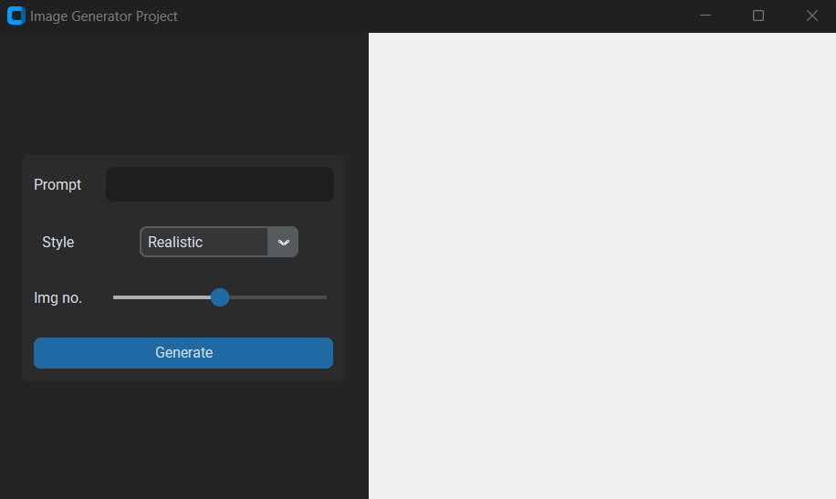
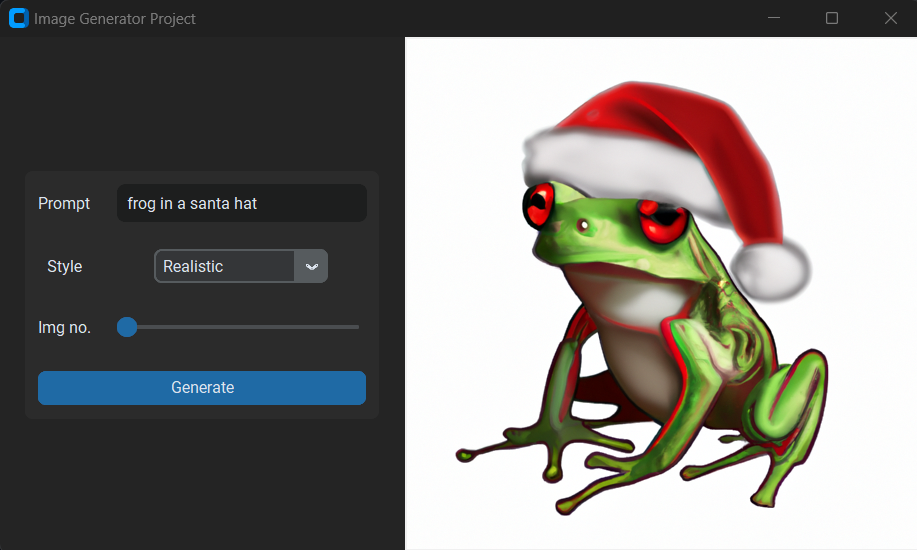

# Installation
To use the Image generator locally, follow these steps:

Clone the repository: 
` git clone https://github.com/your-git-username/Image-Generator.git`

Open the `image_generator.py` file

# Image-Generator
Experience the simplicity of creating captivating images with our Python-based Image Generator powered by the OpenAI API. This user-friendly app is designed for quick and hassle-free image generation. With a straightforward interface, it offers prompt-based image creation, style selection, and the ability to generate multiple images effortlessly.
# Key features
* Prompt-Based Creativity:
  * Begin by entering a brief textual description or concept for your image. The AI will use this prompt to generate a unique visual representation.
    
* Style Selection:
  * Choose from a set of predefined artistic styles or create your own. Apply these styles to your prompt to give your images a distinct look and feel.
    
* Image Quantity Control:
  * Customize the number of images you want to generate. You have control over the output, whether it's one image or a batch of them.
    
* Swift AI-Powered Results:
  * Our application leverages the OpenAI API's cutting-edge machine-learning models to transform your prompts into visually appealing images swiftly.
    
* Minimal Learning Curve:
  * This app is designed with simplicity in mind, making it accessible to users of all skill levels. You don't need to be a Python expert to create stunning images.

# Preview
This is what the program looks like, It's simple to use and very user-friendly.

 

# An example
Here in this example, I'm using one image, a realistic style, and a simple prompt. And It's generated. If you ask for more than 1 image (10 maximum), you'll get a slideshow of all of them.

 

## License

This project is licensed under the MIT License - see the [LICENSE](LICENSE) file for details.
 
## THINGS TO KNOW
- Add your own API key, so the programm can work
